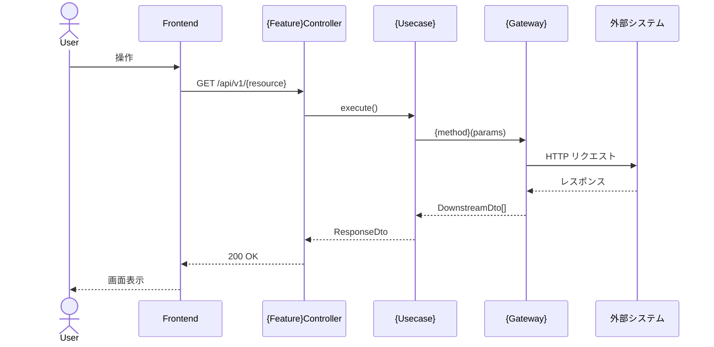

# /planning - Issue 計画コマンド

GitHubのIssueを分析し、設計・影響調査・タスク計画をまとめた `plan.md` を生成します。
生成物は `/dev <issue番号>` コマンドの入力として使用されます。

**使い方**: `/planning <issue_url>`  例: `/planning https://github.com/org/repo/issues/42`

---

## このコマンドが実行するプロセス

```
Step 1: Issue分析                  → 機能概要・受け入れ基準を把握
Step 2: 設計 & APIコントラクト定義  → アーキテクチャ影響範囲・型定義・クラス図・シーケンス図
Step 3: BDDシナリオ定義            → Gherkin（UI仕様まで含めた具体的な記述）
Step 4: Downstreamモックデータ設計  → シナリオごとのモックデータを決定
Step 5: 既存機能への影響調査        → 破壊的変更リスクを洗い出す
         ↓ ユーザー確認・承認
Step 6: plan.md 生成               → docs/issues/{issue番号}/plan.md に保存
```

---

## Step 1: Issue 分析

```bash
gh issue view $ARGUMENTS --json number,title,body,labels,assignees,milestone,comments
```

取得した内容から以下を抽出・整理してください。

- **issue番号**: 以降のディレクトリ名に使用する (`docs/issues/{issue番号}/`)
- **機能概要**: 何を実装するか
- **受け入れ基準 (Acceptance Criteria)**: 完了条件のリスト（BDDシナリオ候補）
- **影響範囲**: フロントエンド / BFF / 両方 / その他
- **非機能要件**: パフォーマンス・セキュリティ・アクセシビリティ等

---

## Step 2: 設計 & APIコントラクト定義

`ARCHITECTURE.md` と `DEVELOPMENT_RULES.md` を参照し、以下を決定してください。

### 2-1. 設計判断

- 新規エンドポイントが必要か → BFF のどのモジュールに追加するか
- 新規ページ・コンポーネントが必要か → フロントエンドのどのディレクトリか
- 既存コードへの影響範囲（破壊的変更の有無）
- 必要であれば ADR を追加（`docs/adr/XXXX-*.md`）

### 2-2. 型・APIコントラクト定義

`shared/types/{feature}.ts` に以下を定義します。

```typescript
// リクエスト型
export type Create{Feature}Request = { ... };

// レスポンス型
export type {Feature}Response = { ... };
export type {Feature}ListResponse = { ... };
```

### 2-3. クラス図・シーケンス図の作成

BFF の実装対象クラスとその関係を Mermaid で表現します。

#### クラス図

Controller・Usecase・Port（Interface）・Gateway・DTO の関係を描きます。

```mermaid
classDiagram
  class {Feature}Controller {
    -{Usecase} usecase
    +{method}() {ResponseDto}
  }

  class {Usecase} {
    -{GatewayPort} gateway
    +execute() Promise~{ResponseDto}~
  }

  class {GatewayPort} {
    <<interface>>
    +{method}(params) Promise~{DownstreamDto}[]~
  }

  class {Gateway} {
    -AxiosInstance axiosInstance
    -Logger logger
    +{method}(params) Promise~{DownstreamDto}[]~
  }

  {Feature}Controller --> {Usecase} : uses
  {Usecase} --> {GatewayPort} : depends on
  {Gateway} ..|> {GatewayPort} : implements
```

**ルール**:
- 依存の方向は必ず Controller → Usecase → Port ← Gateway とすること
- ダウンストリームDTOとBFFレスポンスDTOを別クラスとして明示すること

#### シーケンス図

正常系・異常系それぞれのリクエストフローを描きます。



**ルール**:
- 並列リクエストがある場合は `par` ブロックで表現すること
- 正常系と異常系を必ず別図で描くこと
- 異常系は外部システムのエラーがどのように伝播するかを明示すること

---

## Step 3: BDDシナリオ定義

受け入れ基準をもとに Gherkin 形式でシナリオを定義します。
各シナリオには **シナリオID（SC-1, SC-2, ...）** を付与します。

### Gherkin の記述レベル

**`.feature` ファイルと `.spec.ts` ファイルで記述レベルを明確に分離してください。**

| ファイル | 対象読者 | 記述レベル | 含めてよいもの |
|---|---|---|---|
| `.feature` | PO・テスター・開発者全員 | **振る舞い（ユーザー視点）** | 操作・期待する状態・表示される文言 |
| `.spec.ts` | 開発者・e2e-agent | **実装詳細（UI コントラクト）** | `data-testid`・内部値・URL・セレクター |

#### `.feature` の書き方（振る舞い記述）

`.feature` ファイルは非エンジニアが読んでも「何ができるか」が伝わる記述にしてください。`data-testid` や内部値（`"gain"`, `"loss"` など）は書かないこと。

| 項目 | 悪い例（実装詳細が混入） | 良い例（振る舞い記述） |
|---|---|---|
| 要素の特定 | `Then "[data-testid="stock-card"]" が5件表示される` | `Then 人気上位5銘柄の株価カードが表示される` |
| 内部値の確認 | `And "[data-testid="sort-select"]" の値が "gain" である` | `And デフォルトの並び順が「値上がり順」である` |
| ページ遷移 | `Then URL が "/stocks" になる` | `Then 株価一覧ページが表示される` |
| エラー表示 | `Then "[data-testid="stocks-error"]" に "現在株価を表示できません。" が表示される` | `Then 株価を表示できない旨のエラーメッセージが表示される` |

```gherkin
Feature: {機能名}

  Background:
    Given ユーザーがログイン済みである

  @SC-1
  Scenario: {正常系シナリオ名（ユーザーが何を達成できるか）}
    Given {前提条件（ユーザーが見ている状態）}
    When  {ユーザーの操作（ボタン名・リンクテキスト等）}
    Then  {期待する振る舞い（ユーザーが観察できる状態）}
```

#### `.spec.ts` の書き方（UI コントラクト）

e2e-agent が実装前にテストを書けるよう、`.spec.ts` は **`data-testid`・期待値・URLを含む具体的な記述** にしてください。

```typescript
// @SC-1
test('SC-1: {シナリオ名}', async ({ page }) => {
  // data-testid セレクター・具体的な期待値はここに書く
  await expect(page.locator('[data-testid="stock-card"]')).toHaveCount(5);
  await expect(page.locator('[data-testid="sort-select"]')).toHaveValue('gain');
});
```

**ルール**:
- 受け入れ基準を1つ残らずシナリオに対応させること
- 正常系・異常系・境界値を網羅すること
- `data-testid` はこの `.spec.ts` がコントラクトとなるため、frontend-agent が実装時に必ず付与する

---

## Step 4: Downstream モックデータ設計

E2E テストは `bff/mock-server.mjs` の Downstream モックに依存します。
各シナリオが期待する具体的なデータを設計してください。

```markdown
## Downstream モックデータ設計

### Service A (port 4001) / Service B (port 4002) のデータ

| フィールド | Service A | Service B | BFF が返す値 | 対応シナリオ |
|---|---|---|---|---|
| トヨタ自動車 price_jpy | 350,000 | 360,000 | 355,000（平均） | SC-4 |
| キーエンス price_jpy | 4,000,000 | (存在しない) | 4,000,000 | SC-5 |

### エラー制御 (SC-6 用)
- POST /admin/force-error → Service A・B をエラーモードに切替
- POST /admin/clear-error → エラーモード解除
```

`bff/mock-server.mjs` を実際に確認し、既存データと整合していることを検証してください。

```bash
cat bff/mock-server.mjs
```

シナリオに必要なデータが mock-server.mjs に存在しない場合は、追加すべきデータを plan.md に記載してください（追加実装は backend-agent が担当）。

---

## Step 5: 既存機能への影響調査

### 調査方針

以下の観点でコードベースを調査し、リスクのある箇所を特定してください。

#### 1. ビジネスロジック・意味的な変更リスク（最重要）

- **新しい値・状態の追加**: 既存の条件分岐でその値が考慮されていないケースはないか
- **既存の網羅条件の崩れ**: `switch` 文・ガード節・フィルタ条件が「既存の全パターンを網羅している前提」で書かれていないか
- **集計・一覧の意味変化**: 今回の追加・変更により、既存の一覧取得・集計結果が変わらないか
- **権限・アクセス制御の穴**: 新機能の追加により、認可ルールに抜け穴が生まれないか

#### 2. データモデル・型の変更リスク

- 今回追加・変更するフィールドが既存コードから参照されていないか
- nullable / optional になるフィールドがあれば、既存の参照箇所で null チェックが漏れていないか

#### 3. API レスポンス変更のリスク

- 今回変更・追加するエンドポイントを既存のフロントエンドコードが利用していないか

#### 4. 共有モジュール・共通コンポーネントの変更リスク

- 今回変更するモジュール・コンポーネントを他の機能が import していないか

```bash
grep -rn "{変更対象キーワード}" --include="*.ts" --include="*.tsx" .
```

---

## Step 6: ユーザー確認 & plan.md 生成

調査結果をユーザーに提示し、**承認を得てから `plan.md` を生成してください**。

提示フォーマット:
```
## 計画サマリー

### 機能概要
{概要}

### BDD シナリオ一覧
| シナリオID | シナリオ名 | 種別 |
|---|---|---|
| SC-1 | ... | 正常系 |
| SC-2 | ... | 異常系 |

### Downstream モックデータ
{追加・変更が必要なデータの概要}

### 既存機能への影響
| リスク | 種別 | 対処方針 |
|---|---|---|

この計画で問題ありませんか？ [yes / 修正内容を記載]
```

ユーザーが **yes** と回答したら、以下のファイルを生成してください。

### 生成するファイル

**`docs/issues/{issue番号}/plan.md`** — `/dev` コマンドが読み込む計画書:

```markdown
# 実装計画 - Issue #{issue番号}: {タイトル}

作成日時: {YYYY-MM-DD}
Issue URL: {url}

## 機能概要

{概要}

## 影響範囲

- [ ] BFF
- [ ] Frontend
- [ ] 共有型定義 (`shared/types/`)

## APIコントラクト

`shared/types/{feature}.ts` に定義済み。

### エンドポイント
| メソッド | パス | 説明 |
|---|---|---|
| GET | /api/v1/{resource} | ... |

### 型定義
（shared/types/{feature}.ts 参照）

## BFF クラス図

\`\`\`mermaid
classDiagram
  %% Step 2-3 で作成したクラス図をそのまま貼り付ける
\`\`\`

## シーケンス図

### 正常系

\`\`\`mermaid
sequenceDiagram
  %% Step 2-3 で作成した正常系シーケンス図をそのまま貼り付ける
\`\`\`

### 異常系

\`\`\`mermaid
sequenceDiagram
  %% Step 2-3 で作成した異常系シーケンス図をそのまま貼り付ける
\`\`\`

## BDD シナリオ一覧

| シナリオID | シナリオ名 | 種別 |
|---|---|---|
| SC-1 | {名前} | 正常系 |
| SC-2 | {名前} | 異常系 |

### シナリオ詳細（Gherkin）

\`\`\`gherkin
Feature: {機能名}

  Background:
    Given ユーザーが "test@example.com" / "password123" でログイン済みである

  @SC-1
  Scenario: {シナリオ名}
    Given ...
    When  ...
    Then  "[data-testid="xxx"]" が表示される
\`\`\`

## Downstream モックデータ設計

### Service A (port 4001) / Service B (port 4002)

| フィールド | Service A | Service B | BFF が返す値 | 対応シナリオ |
|---|---|---|---|---|
| {銘柄} {フィールド} | {値} | {値} | {値} | SC-X |

### mock-server.mjs への変更
{追加・変更が必要な場合のみ記載。不要なら「変更不要」と記載}

## 既存機能への影響調査結果

### 🔴 High リスク
| 影響機能 | ファイルパス:行 | リスク内容 | 対処方針 |
|---|---|---|---|

### 🟡 Medium リスク
| 影響機能 | ファイルパス:行 | リスク内容 | 対処方針 |
|---|---|---|---|

### 🟢 Low / 影響なし
{影響なしと判断した根拠}

## タスク計画

### Phase A: テストファースト（実装開始前・シナリオごとに実施）
| # | 内容 | 担当エージェント |
|---|---|---|
| A-1 | E2Eテスト先行作成（シナリオ単位） | e2e-agent |

### Phase B: 実装（テスト承認後・シナリオごとに実施）
| # | 内容 | 担当エージェント | 依存 |
|---|---|---|---|
| B-1 | BFF実装 | backend-agent | A-1承認 |
| B-2 | Frontend実装 | frontend-agent | A-1承認 |
| B-3 | BFF ユニットテスト | backend-test-agent | B-1 |
| B-4 | Frontend ユニットテスト | frontend-test-agent | B-2 |
| B-5 | E2E テスト実行・Pass確認 | e2e-agent | B-1・B-2 |
| B-6 | 内部品質レビュー | code-review-agent | B-1〜B-4 |
| B-7 | セキュリティレビュー | security-review-agent | B-1・B-2 |
```

生成完了後、以下を出力してください。

```
✅ 計画書を生成しました: docs/issues/{issue番号}/plan.md

次のステップ:
  /dev {issue番号}
```
