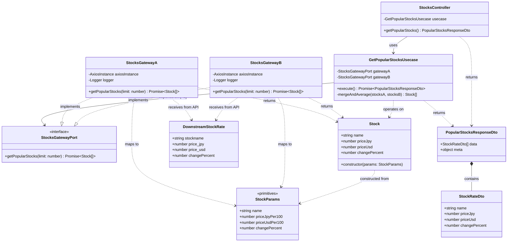
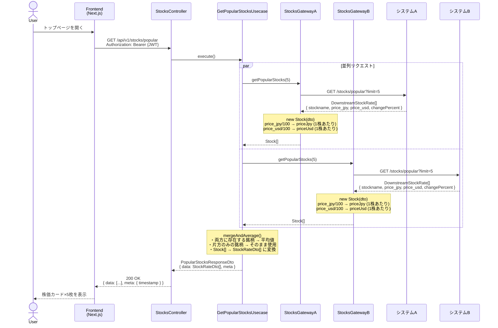
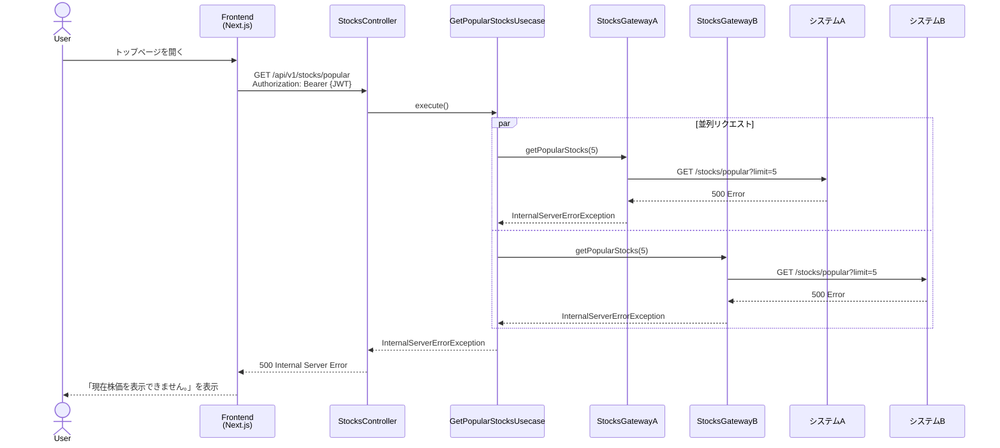

# 実装計画 - Issue #1: ユーザとして人気トップ5株銘柄別のレート情報が表示されること

作成日時: 2026-03-21
Issue URL: https://github.com/sikes-311/bff/issues/1

## 機能概要

ログイン後のトップページに人気上位5銘柄の株価カードを表示する。
各カードには銘柄名・100株あたりの円建て/ドル建て株価・前日比(%)を表示する。
2つのダウンストリームシステムから並列取得し平均値を使用（片方にのみ存在する銘柄はその値をそのまま使用）。
「その他の株価を見る」で株価一覧ページへ遷移。APIエラー時は「現在株価を表示できません。」を表示する。

## 影響範囲

- [x] BFF (`bff/src/modules/stocks/` を新規追加)
- [x] Frontend (トップページ修正・株価一覧ページ新規追加)
- [ ] 共有型定義 (`shared/types/`)

## APIコントラクト

### エンドポイント

| メソッド | パス                   | 認証    | 説明                              |
| -------- | ---------------------- | ------- | --------------------------------- |
| GET      | /api/v1/stocks/popular | JWT必須 | 人気上位5銘柄の株価レート一覧取得 |

### ダウンストリームレスポンス型（外部2システムが返す形式）

```typescript
// downstream-stock.dto.ts
type DownstreamStockRate = {
  stockname: string;
  price_jpy: number; // 100株あたりの円建て株価
  price_usd: number; // 100株あたりのドル建て株価
  changePercent: number; // 前日比(%)
};
```

### BFF レスポンス型（フロントエンド向け）

```typescript
// stock-response.dto.ts
class StockRateDto {
  name: string;
  priceJpy: number; // 100株あたり円建て（2システム平均 or 片方の値）
  priceUsd: number; // 100株あたりドル建て（2システム平均 or 片方の値）
  changePercent: number; // 前日比(%)（2システム平均 or 片方の値）
}

class PopularStocksResponseDto {
  data: StockRateDto[];
  meta: { timestamp: string };
}
```

## BFF クラス図



## BFF ディレクトリ構成

```
bff/src/modules/stocks/
├── stocks.module.ts
├── stocks.controller.ts
├── domain/
│   └── stock.ts                         # ドメインモデル: 100株→1株変換をconstructorで実施
├── usecase/
│   └── get-popular-stocks.usecase.ts    # 両Gatewayを並列呼び出し・Stock[]を集約
├── gateway/
│   ├── stocks-service-a.gateway.ts      # システムA向け通信・new Stock(dto)で変換
│   └── stocks-service-b.gateway.ts      # システムB向け通信・new Stock(dto)で変換
├── port/
│   └── stocks.gateway.port.ts           # A・B共通インターフェース (Stock[]を返す) + DIトークン定義
└── dto/
    ├── downstream-stock.dto.ts           # 外部システムのレスポンス型 (snake_case)
    └── stock-response.dto.ts             # フロントエンド向けレスポンスDTO
```

## 設計詳細

### ドメインモデル (`domain/stock.ts`)

`Stock` クラスの `constructor` が DownstreamDTO を受け取り、外部システム固有の値をドメインの値に変換する。

```typescript
export class Stock {
  readonly name: string;
  readonly priceJpy: number;    // 1株あたり円建て
  readonly priceUsd: number;    // 1株あたりドル建て
  readonly changePercent: number;

  // DIP遵守: DownstreamStockRate を直接受け取らず、プリミティブ値を受け取る
  // DownstreamDTO → プリミティブへのマッピングは Gateway の責務
  constructor(params: {
    name: string;
    priceJpyPer100: number;
    priceUsdPer100: number;
    changePercent: number;
  }) {
    this.name = params.name;
    this.priceJpy = params.priceJpyPer100 / 100;   // 100株あたり → 1株あたりに変換
    this.priceUsd = params.priceUsdPer100 / 100;   // 100株あたり → 1株あたりに変換
    this.changePercent = params.changePercent;
  }
}
```

```typescript
// Gateway の責務: DownstreamDTO のフィールドをプリミティブとして Stock に渡す
return response.data.map(dto => new Stock({
  name: dto.stockname,
  priceJpyPer100: dto.price_jpy,
  priceUsdPer100: dto.price_usd,
  changePercent: dto.changePercent,
}));
```

- **責務**: ダウンストリームのレスポンスをフロントエンドで表示可能なデータに変換する際のビジネスロジックを集約する。単位変換・命名の正規化はここに閉じ込め、Usecase・Gateway に散らばらせない
- **DIP遵守**: 最内層のため外部への依存ゼロ。DownstreamDTO を直接受け取らないことで、外部APIの型変更が Domain に波及しない
- NestJS / axios への依存ゼロのため、単体テストがシンプルになる
- 変換ルールが変わった場合、`stock.ts` だけを修正すれば他の層に影響しない

### 平均値計算ロジック

- Gateway が `new Stock(dto)` で変換済みの `Stock[]` を返す
- Usecase は `Stock.name` をキーに2システムの結果を突合する
- 両システムに存在する銘柄: `priceJpy`, `priceUsd`, `changePercent` の平均値を使用
- 片方のシステムにのみ存在する銘柄: その値をそのまま使用
- 最終的に `Stock[]` → `StockRateDto[]` に変換して `PopularStocksResponseDto` を返す

### HTTP通信方式

- 各 Gateway のコンストラクタ内で `ConfigService` から URL を取得し `axios.create()` でクライアントを生成する
- 環境変数: `STOCK_SERVICE_A_URL`, `STOCK_SERVICE_B_URL`

### Module登録

```typescript
// stocks.module.ts
@Module({
  controllers: [StocksController],
  providers: [
    StocksGatewayA,
    StocksGatewayB,
    { provide: STOCKS_GATEWAY_A_PORT, useExisting: StocksGatewayA },
    { provide: STOCKS_GATEWAY_B_PORT, useExisting: StocksGatewayB },
    GetPopularStocksUsecase,
  ],
})
export class StocksModule {}
```

`app.module.ts` に `StocksModule` をインポートする。

## シーケンス図

### 正常系（SC-1 / SC-3 / SC-4 / SC-5）



### 異常系（SC-6）：両システムともAPIエラー



## BDD シナリオ一覧

| シナリオID | シナリオ名                                                            | 種別   |
| ---------- | --------------------------------------------------------------------- | ------ |
| SC-1       | ログイン後トップページで人気上位5銘柄の株価カードが表示される         | 正常系 |
| SC-2       | 「その他の株価を見る」タップで株価一覧ページへ遷移できる              | 正常系 |
| SC-3       | カード内に銘柄名・円建て株価・ドル建て株価・前日比(%)が表示される     | 正常系 |
| SC-4       | 両システムに存在する銘柄は2システムの平均値が表示される               | 正常系 |
| SC-5       | 片方のシステムにのみ存在する銘柄はその値がそのまま表示される          | 正常系 |
| SC-6       | 両システムともAPIエラー時に「現在株価を表示できません。」が表示される | 異常系 |

### シナリオ詳細（Gherkin）

```gherkin
Feature: 人気トップ5株銘柄のレート情報表示

  Background:
    Given ユーザーがログイン済みである

  @SC-1
  Scenario: ログイン後トップページで人気上位5銘柄の株価カードが表示される
    Given トップページを開いている
    When ログインを行う
    Then ログイン後のトップページで人気上位5銘柄の株価カードが表示される

  @SC-2
  Scenario: 株価表示カードセクションの「その他の株価を見る」で株価一覧ページへ遷移
    Given トップページを開いている
    When ログインを行う
    And 株価表示カードセクションの右端の「その他の株価を見る」をタップする
    Then 株価一覧ページが表示される

  @SC-3
  Scenario: カード内に銘柄名・円建て株価・ドル建て株価・前日比(%)が表示される
    Given トップページを開いている
    When ログインを行う
    Then ログイン後のトップページで人気上位5銘柄の株価カードが表示される
    And 1カード内に銘柄名・円建て株価・ドル建て株価・前日比(%)が表示される

  @SC-4
  Scenario: 両システムに存在する銘柄は2システムの平均値が表示される
    Given システムAとシステムBの両方に同一銘柄が存在する
    When トップページの株価カードが表示される
    Then 該当銘柄の株価は2システムの平均値で表示される

  @SC-5
  Scenario: 片方のシステムにのみ存在する銘柄はその値がそのまま表示される
    Given システムAにのみ存在する銘柄がある
    When トップページの株価カードが表示される
    Then 該当銘柄の株価はシステムAの値がそのまま表示される

  @SC-6
  Scenario: 両システムともAPIエラー時に「現在株価を表示できません。」が表示される
    Given トップページを開いている
    And 株価一覧取得APIでエラーが発生するようになっていること
    When ログインを行う
    Then ログイン後のトップページで人気上位5銘柄の株価カードが表示される場所に「現在株価を表示できません。」と表示される
```

## 既存機能への影響調査結果

### 🟢 Low / 影響なし

- 新規モジュール (`stocks`) の追加のみであり、既存モジュール (`users`, `auth`) への変更なし
- `app.module.ts` へ `StocksModule` のインポート追加のみ（既存モジュールの動作に影響なし）
- `frontend/src/app/page.tsx` に株価カードセクションを追加するが、既存のリンク（ユーザー管理・ログイン）は保持

## タスク計画

| #   | 内容                                                                                              | 担当エージェント      | 依存   |
| --- | ------------------------------------------------------------------------------------------------- | --------------------- | ------ |
| 1   | BFF実装: `stocks` モジュール（Controller / Usecase / Gateway×2 / Port / DTO）                     | backend-agent         | -      |
| 2   | Frontend実装: 株価カードコンポーネント・APIクライアント・フック・株価一覧ページ・トップページ修正 | frontend-agent        | -      |
| 3   | BFF ユニットテスト                                                                                | backend-test-agent    | #1     |
| 4   | Frontend ユニットテスト                                                                           | frontend-test-agent   | #2     |
| 5   | アーキテクチャテスト (`src/arch/arch.spec.ts`) — DIP 依存方向の自動検証                          | backend-test-agent    | #1     |
| 6   | 内部品質レビュー                                                                                  | code-review-agent     | #1〜#5 |
| 7   | セキュリティレビュー                                                                              | security-review-agent | #1〜#2 |
