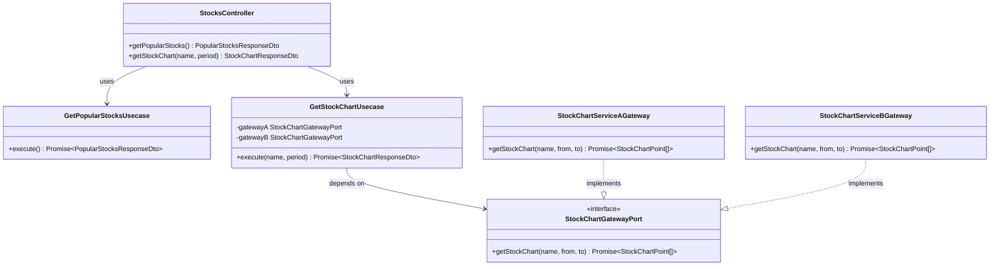
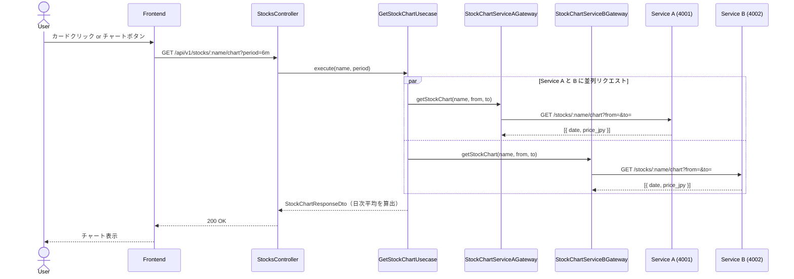
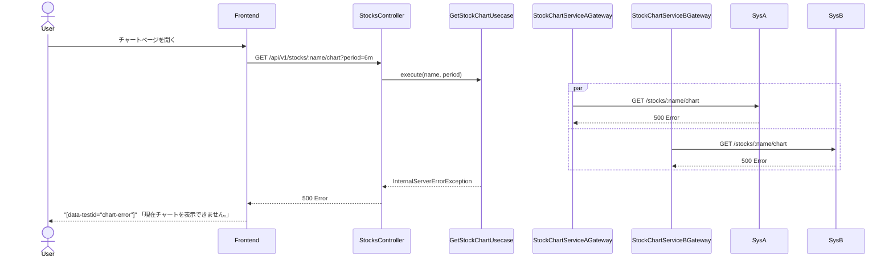

# 実装計画 - Issue #2: ユーザとして銘柄の価格チャートを確認する

作成日時: 2026-03-21
Issue URL: https://github.com/sikes-311/bff/issues/2

## 機能概要

株価チャートページ (`/stocks/[name]/chart`) を新規作成し、銘柄ごとの過去円建て株価を Recharts 折れ線グラフで表示する。

- トップページの株価カードをクリック → チャートページへ遷移
- 株価一覧ページの「チャート」ボタン → チャートページへ遷移
- 表示期間: 6ヶ月（デフォルト）/ 1年 / 2年 / 10年
- 目盛りフォーマット:
  - 6ヶ月: `yyyy/mm`（月単位）
  - 1年: `yyyy/mm`（2ヶ月単位）
  - 2年: `yyyy/mm`（4ヶ月単位）
  - 10年: `yyyy`（年単位）
- エラー時: 「現在チャートを表示できません。」を表示
- X軸 tick はカスタムコンポーネントに `data-testid="chart-x-tick"` を付与し Playwright でフォーマット検証可能にする

## 影響範囲

- [x] BFF（`stocks` モジュールに新規 usecase・gateway・port・dto 追加）
- [x] Frontend（新規ページ・既存コンポーネント変更）
- [ ] 共有型定義 (`shared/types/`)

## API コントラクト

### エンドポイント

| メソッド | パス | 説明 |
|---|---|---|
| GET | /api/v1/stocks/:name/chart | 銘柄のチャートデータ取得（新規） |
| GET | /api/v1/stocks/popular | 人気上位5銘柄取得（既存・変更なし） |

### クエリパラメータ

| パラメータ | 型 | 必須 | 値 | 説明 |
|---|---|---|---|---|
| `period` | string | 任意 | `6m` / `1y` / `2y` / `10y` | 表示期間（デフォルト: `6m`） |

### 型定義

`shared/types/stock-chart.ts` に定義:

```typescript
export type ChartPeriod = '6m' | '1y' | '2y' | '10y';

export type StockChartPoint = {
  date: string;     // YYYY-MM-DD
  priceJpy: number;
};

export type StockChartResponse = {
  data: {
    name: string;
    period: ChartPeriod;
    items: StockChartPoint[];
  };
  meta: { timestamp: string };
};
```

## BFF クラス図



## シーケンス図

### 正常系



### 異常系



## BDD シナリオ一覧

| シナリオID | シナリオ名 | 種別 |
|---|---|---|
| SC-9 | トップページのカードをクリックするとチャートページに遷移する | 正常系 |
| SC-10 | 株価一覧ページの「チャート」ボタンからチャートページに遷移する | 正常系 |
| SC-11 | チャートページでデフォルト6ヶ月のチャートが表示される | 正常系 |
| SC-12 | 表示期間を「1年」に切り替えるとチャートが変わる | 正常系 |
| SC-13 | 表示期間を「2年」に切り替えるとチャートが変わる | 正常系 |
| SC-14 | 表示期間を「10年」に切り替えるとチャートが変わる | 正常系 |
| SC-15 | チャートAPIエラー時に「現在チャートを表示できません。」が表示される | 異常系 |

### シナリオ詳細（Gherkin）

```gherkin
Feature: 株価チャート表示

  Background:
    Given ユーザーがログイン済みである

  @SC-9
  Scenario: トップページのカードをクリックするとチャートページに遷移する
    Given トップページを開いている
    When トヨタ自動車の株価カードをクリックする
    Then トヨタ自動車の株価チャートページが表示される

  @SC-10
  Scenario: 株価一覧ページの「チャート」ボタンからチャートページに遷移する
    Given 株価一覧ページを開いている
    When トヨタ自動車の「チャート」ボタンをタップする
    Then トヨタ自動車の株価チャートページが表示される

  @SC-11
  Scenario: チャートページでデフォルト6ヶ月のチャートが表示される
    Given トヨタ自動車の株価チャートページを開いている
    Then チャートが表示される
    And デフォルトの表示期間が「6ヶ月」である
    And X軸の目盛りが月単位（yyyy/mm形式）で表示される

  @SC-12
  Scenario: 表示期間を「1年」に切り替えるとチャートが変わる
    Given トヨタ自動車の株価チャートページを開いている
    When 表示期間で「1年」を選択する
    Then チャートが1年分の期間で表示される
    And X軸の目盛りが月単位（yyyy/mm形式）で表示される

  @SC-13
  Scenario: 表示期間を「2年」に切り替えるとチャートが変わる
    Given トヨタ自動車の株価チャートページを開いている
    When 表示期間で「2年」を選択する
    Then チャートが2年分の期間で表示される
    And X軸の目盛りが月単位（yyyy/mm形式）で表示される

  @SC-14
  Scenario: 表示期間を「10年」に切り替えるとチャートが変わる
    Given トヨタ自動車の株価チャートページを開いている
    When 表示期間で「10年」を選択する
    Then チャートが10年分の期間で表示される
    And X軸の目盛りが年単位（yyyy形式）で表示される

  @SC-15
  Scenario: チャートAPIエラー時にエラーメッセージが表示される
    Given チャート情報取得APIでエラーが発生するようになっている
    When トヨタ自動車の株価チャートページを開く
    Then 「現在チャートを表示できません。」というエラーメッセージが表示される
```

## Downstream モックデータ設計

### mock-server.mjs への変更

以下を追加する（backend-agent が実装）:

#### 追加エンドポイント

| エンドポイント | 説明 |
|---|---|
| `GET /stocks/:name/chart?from=YYYY-MM-DD&to=YYYY-MM-DD` | 指定期間の月次株価データを返す |
| `POST /admin/force-chart-error` | チャート専用エラーモード ON（`/stocks/popular` のエラーモードとは独立） |
| `POST /admin/clear-chart-error` | チャート専用エラーモード OFF |

#### チャートモックデータ（Service A / B 各10年分・月次）

| 銘柄 | Service A 開始値(JPY) | Service A 終了値(JPY) | Service B 開始値(JPY) | Service B 終了値(JPY) | 対応シナリオ |
|---|---|---|---|---|---|
| トヨタ自動車 | 300,000 | 380,000 | 310,000 | 390,000 | SC-9〜SC-15（主テスト対象） |
| ソニーグループ | 1,100,000 | 1,300,000 | 1,120,000 | 1,310,000 | SC-9〜SC-14 |
| 任天堂 | 650,000 | 780,000 | 660,000 | 790,000 | SC-9〜SC-14 |
| ソフトバンク | 150,000 | 200,000 | 155,000 | 205,000 | SC-9〜SC-14 |
| キーエンス | 3,800,000 | 4,200,000 | (存在しない) | - | SC-9〜SC-14 |

- データ期間: 2016-01-01 〜 2026-03-01（122ヶ月）
- キーエンスは Service A のみに存在（`/stocks/popular` と同じ仕様）
- 各月初日 (YYYY-MM-01) のデータポイントを1件ずつ返す
- `from`/`to` パラメータでフィルタリングして返す

#### E2E テストで検証する tick フォーマット

| 期間 | `from` 計算 | tick フォーマット | Playwright アサーション |
|---|---|---|---|
| 6m | 現在日 - 6ヶ月 | `yyyy/mm` | `toMatch(/^\d{4}\/\d{2}$/)` |
| 1y | 現在日 - 1年 | `yyyy/mm` | `toMatch(/^\d{4}\/\d{2}$/)` |
| 2y | 現在日 - 2年 | `yyyy/mm` | `toMatch(/^\d{4}\/\d{2}$/)` |
| 10y | 現在日 - 10年 | `yyyy` | `toMatch(/^\d{4}$/)` |

## 既存機能への影響調査結果

### 🔴 High リスク

なし

### 🟡 Medium リスク

| 影響機能 | ファイルパス | リスク内容 | 対処方針 |
|---|---|---|---|
| トップページ株価カード | `components/features/stocks/stock-card.tsx` | `href` prop 追加でカード全体が `<Link>` になる | `stock-card.test.tsx` にナビゲーションテスト追加 |
| トップページ株価セクション | `components/features/stocks/popular-stocks-section.tsx` | StockCard に `href` を渡す変更 | 既存テスト (`popular-stocks-section.test.tsx`) はレンダリングのみ確認のため影響軽微 |
| 株価一覧ページ | `app/stocks/page.tsx` | 各カードに「チャート」ボタン追加 | SC-7・SC-8 は card 件数・順序のみ確認のため影響なし |

### 🟢 Low / 影響なし

- `bff/src/modules/stocks/stocks.gateway.port.ts`: 既存 `getPopularStocks` は変更なし。新規 `StockChartGatewayPort` を別ファイルで定義
- `bff/src/modules/stocks/usecase/get-popular-stocks.usecase.ts`: 変更なし
- 既存 E2E テスト SC-1〜SC-8: `popular-stocks-section` と株価一覧の並び替えをテスト。チャート遷移追加による影響なし（カードの `data-testid` は維持）

## タスク計画

### Phase A: テストファースト（実装開始前）

| # | 内容 | 担当エージェント |
|---|---|---|
| A-1 | E2Eテスト先行作成（SC-9〜SC-15） | e2e-agent |

### Phase B: 実装（テスト承認後）

| # | 内容 | 担当エージェント | 依存 |
|---|---|---|---|
| B-1 | BFF実装（`GetStockChartUsecase`・Gateway・Port・DTO・Controller endpoint追加） | backend-agent | A-1承認 |
| B-2 | Frontend実装（チャートページ・StockCard変更・チャートボタン追加・Recharts導入） | frontend-agent | A-1承認 |
| B-3 | mock-server.mjs 更新（チャートデータ・chart error mode追加） | backend-agent | A-1承認 |
| B-4 | BFF ユニットテスト | backend-test-agent | B-1 |
| B-5 | Frontend ユニットテスト | frontend-test-agent | B-2 |
| B-6 | E2E テスト実行・Pass確認（SC-9〜SC-15） | e2e-agent | B-1・B-2・B-3 |
| B-7 | 内部品質レビュー | code-review-agent | B-1〜B-5 |
| B-8 | セキュリティレビュー | security-review-agent | B-1・B-2 |

---

## 実装メモ

### BFF 実装メモ（backend-agent 向け）

**period → from/to 計算ロジック**（`GetStockChartUsecase` 内）:
```typescript
const now = new Date();
const from = new Date(now);
switch (period) {
  case '6m': from.setMonth(from.getMonth() - 6); break;
  case '1y': from.setFullYear(from.getFullYear() - 1); break;
  case '2y': from.setFullYear(from.getFullYear() - 2); break;
  case '10y': from.setFullYear(from.getFullYear() - 10); break;
}
// from を YYYY-MM-DD 文字列に変換して Downstream に渡す
```

**A・B 集約ロジック**:
- 両サービスから取得した日付をキーにした Map でマージ
- 同一日付が両方にある → 平均値
- 片方のみ → そのまま使用
- 両方失敗 → `InternalServerErrorException`

**新規ファイル**（既存 `bff/src/modules/stocks/` 配下に追加）:
- `usecase/get-stock-chart.usecase.ts`
- `port/stock-chart.gateway.port.ts`
- `gateway/stock-chart-service-a.gateway.ts`
- `gateway/stock-chart-service-b.gateway.ts`
- `dto/stock-chart-response.dto.ts`
- `domain/stock-chart-point.ts`（必要に応じて）

**Controller に追加するエンドポイント**:
```typescript
@Get(':name/chart')
@ApiOperation({ summary: '銘柄の株価チャートデータ取得' })
async getStockChart(
  @Param('name') name: string,
  @Query('period') period: ChartPeriod = '6m',
): Promise<StockChartResponseDto>
```

### Frontend 実装メモ（frontend-agent 向け）

**新規ファイル**:
- `app/stocks/[name]/chart/page.tsx` — チャートページ
- `components/features/stocks/stock-chart.tsx` — Recharts 折れ線グラフ
- `hooks/use-stock-chart.ts` — TanStack Query フック
- `lib/api/stock-chart.ts` — API クライアント

**X軸カスタム tick**（テスタビリティのために必須）:
```tsx
function CustomXTick({ x, y, payload }: { x: number; y: number; payload: { value: string } }) {
  return (
    <text x={x} y={y} data-testid="chart-x-tick" textAnchor="middle" fontSize={12}>
      {payload.value}
    </text>
  );
}
// XAxis に: tick={<CustomXTick x={0} y={0} payload={{ value: '' }} />}
```

**tick フォーマット関数**:
```typescript
function formatTick(dateStr: string, period: ChartPeriod): string {
  const date = new Date(dateStr);
  if (period === '10y') return String(date.getFullYear());
  return `${date.getFullYear()}/${String(date.getMonth() + 1).padStart(2, '0')}`;
}
```

**tick 間引き（ticks props）**:
- 6m: 毎月（tickCount=6）
- 1y: 2ヶ月ごと（tickCount=6）
- 2y: 4ヶ月ごと（tickCount=6）
- 10y: 毎年（tickCount=10）

**data-testid 一覧**（frontend-agent が必ず付与）:
- `data-testid="stock-chart"` — チャートコンテナ
- `data-testid="chart-x-tick"` — X軸 tick（カスタム tick コンポーネント）
- `data-testid="chart-period-select"` — 期間セレクト
- `data-testid="chart-error"` — エラー表示
- `data-testid="chart-loading"` — ローディング表示

**stock-card.tsx 変更**:
```tsx
// href prop を追加。提供された場合はカード全体を Link でラップ
type Props = {
  stock: StockRate;
  href?: string;
};
```

**URL エンコード**:
```typescript
// popular-stocks-section.tsx と stocks/page.tsx で
const chartHref = `/stocks/${encodeURIComponent(stock.name)}/chart`;
```
