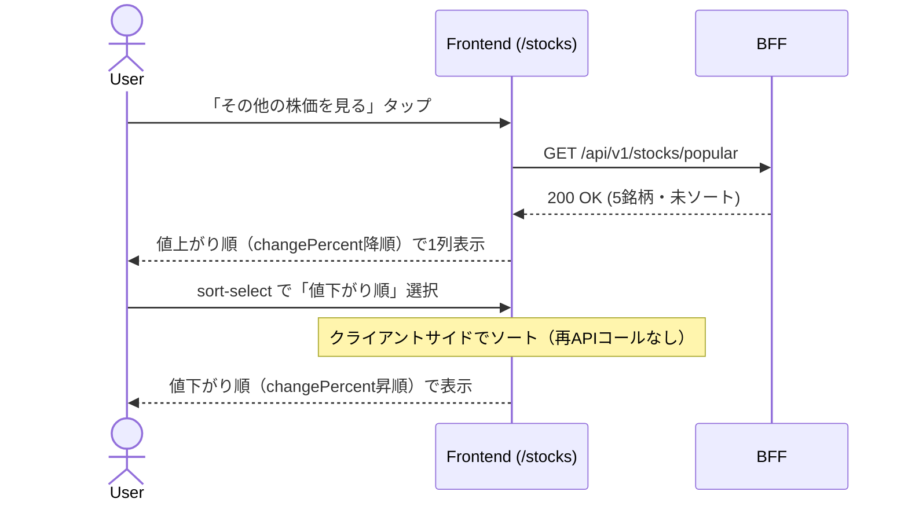
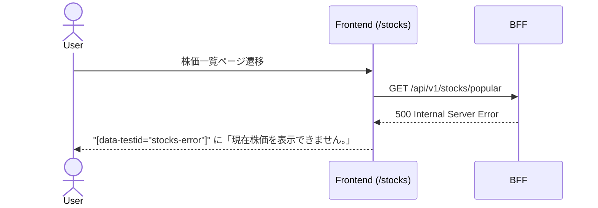

# 実装計画 - Issue #3: ユーザーとして株価チャートの一覧を確認する

作成日時: 2026-03-21
Issue URL: https://github.com/sikes-311/bff/issues/3

## 機能概要

「その他の株価を見る」から遷移した株価一覧ページ (`/stocks`) に並び替え機能を追加する。

- デフォルト表示は値上がり順（changePercent 降順）
- 並び替えドロップダウンで値下がり順（changePercent 昇順）に切り替え可能
- カードは1列レイアウトで表示
- **同率の場合は銘柄名の五十音順（localeCompare 昇順）でタイブレーク**
- ソートはクライアントサイドで実装（BFF 変更なし）

## 影響範囲

- [ ] BFF（変更なし）
- [x] Frontend (`frontend/src/app/stocks/page.tsx` のみ変更)
- [ ] 共有型定義 (`shared/types/`)（変更なし）

## API コントラクト

変更なし。既存の `GET /api/v1/stocks/popular` を流用する。

### エンドポイント

| メソッド | パス | 説明 |
|---|---|---|
| GET | /api/v1/stocks/popular | 人気上位5銘柄の株価一覧取得（既存） |

## BFF クラス図

変更なし（既存の実装をそのまま利用）。

## シーケンス図

### 正常系（ソート切り替え）



### 異常系



## BDD シナリオ一覧

| シナリオID | シナリオ名 | 種別 |
|---|---|---|
| SC-7 | 株価一覧ページで株価カードがデフォルトで値上がり順（1列）に表示される | 正常系 |
| SC-8 | 並び替えドロップダウンで値下がり順を選択すると表示順が変わる | 正常系 |

### シナリオ詳細（Gherkin）

```gherkin
Feature: 株価一覧の並び替え

  Background:
    Given ユーザーがログイン済みである

  @SC-7
  Scenario: 株価一覧ページで銘柄がデフォルトで値上がり順に表示される
    Given トップページを開いている
    When 「その他の株価を見る」をタップする
    Then 株価一覧ページが表示される
    And デフォルトの並び順が「値上がり順」である
    And 全銘柄が1列で表示される
    And 最も値上がりした銘柄が先頭に表示される
    And 最も値下がりした銘柄が末尾に表示される

  @SC-8
  Scenario: 並び替えを「値下がり順」に変更すると表示順が変わる
    Given 株価一覧ページを開いている
    When 並び替えを「値下がり順」に変更する
    Then 最も値下がりした銘柄が先頭に表示される
    And 最も値上がりした銘柄が末尾に表示される
```

## Downstream モックデータ設計

### mock-server.mjs への変更

変更不要。既存データで期待するソート順を検証できる。

### Service A (port 4001) / Service B (port 4002) の計算結果

| 銘柄 | Service A changePercent | Service B changePercent | BFF が返す平均値 | 値上がり順位 |
|---|---|---|---|---|
| 任天堂 | +2.3% | +2.5% | **+2.4%** | 1位 |
| トヨタ自動車 | +1.5% | +1.7% | **+1.6%** | 2位 |
| ソフトバンク | +0.5% | +0.7% | **+0.6%** | 3位 |
| キーエンス | +0.3% | (存在しない) | **+0.3%** | 4位 |
| ソニーグループ | -0.8% | -0.6% | **-0.7%** | 5位（値下がり1位） |

## 既存機能への影響調査結果

### 🔴 High リスク

なし

### 🟡 Medium リスク

なし

### 🟢 Low / 影響なし

- `frontend/e2e/stocks.spec.ts` (SC-1〜SC-6): トップページの `popular-stocks-section` をテストしており、`/stocks` ページのレイアウト変更に影響しない
- `frontend/src/components/features/stocks/popular-stocks-section.tsx`: 変更対象外。`/stocks` ページとは独立したコンポーネント
- `frontend/src/components/features/stocks/stock-card.tsx`: `data-testid` は既に設定済みのため変更不要

## タスク計画

### Phase A: テストファースト（実装開始前）

| # | 内容 | 担当エージェント |
|---|---|---|
| A-1 | E2Eテスト先行作成（SC-7・SC-8） | e2e-agent |

### Phase B: 実装（テスト承認後）

| # | 内容 | 担当エージェント | 依存 |
|---|---|---|---|
| B-1 | Frontend実装（`/stocks/page.tsx` 並び替え機能追加） | frontend-agent | A-1承認 |
| B-2 | Frontend ユニットテスト | frontend-test-agent | B-1 |
| B-3 | E2E テスト実行・Pass確認 | e2e-agent | B-1 |
| B-4 | 内部品質レビュー | code-review-agent | B-1・B-2 |
| B-5 | セキュリティレビュー | security-review-agent | B-1 |

---

## 実装メモ（frontend-agent 向け）

### `/stocks/page.tsx` の変更内容

1. **レイアウト変更**: グリッドを1列に変更（`grid-cols-1` のみ）
2. **ソートステート追加**: `'gain' | 'loss'` （デフォルト: `'gain'`）
3. **並び替えドロップダウン追加**: `data-testid="sort-select"` の `<select>` 要素
   - オプション: `<option value="gain">値上がり順</option>` / `<option value="loss">値下がり順</option>`
4. **ソートロジック**: `changePercent` でソート。同率の場合は `name.localeCompare()` でタイブレーク
5. **data-testid 追加**:
   - `data-testid="stocks-list"`: カード一覧のコンテナ
   - `data-testid="stocks-error"`: エラー表示（現状なし）
